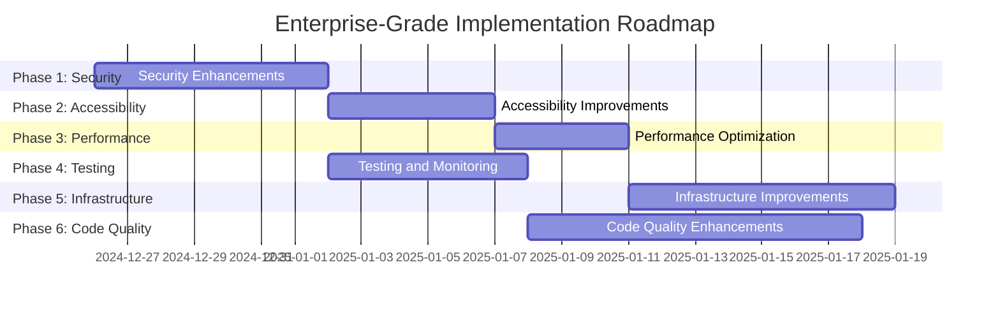

# Enterprise-Grade Implementation Plan

## Overview

This plan outlines a phased approach to implementing enterprise-grade improvements for the Properties 4 Creations website based on the comprehensive audit findings.

## Phase 1: Security Enhancements (High Priority)

### Objective: Strengthen security posture and implement server-side validation

#### Tasks:
1. **Implement server-side CSRF token generation and validation**
   - Create server endpoint for CSRF token generation
   - Add server-side validation for form submissions
   - Integrate with existing client-side CSRF protection

2. **Add rate limiting for form submissions**
   - Implement rate limiting middleware
   - Configure reasonable limits (e.g., 5 submissions per minute)
   - Add appropriate error responses

3. **Implement CSP reporting endpoint**
   - Create endpoint to receive CSP violation reports
   - Add logging and monitoring for violations
   - Configure CSP header to report violations

4. **Add security.txt file**
   - Create security.txt file in .well-known directory
   - Include vulnerability reporting contact information
   - Add acknowledgments and policy information

#### Deliverables:
- Server-side CSRF implementation
- Rate limiting middleware
- CSP reporting endpoint
- security.txt file

## Phase 2: Accessibility Improvements (High Priority)

### Objective: Enhance accessibility compliance and user experience

#### Tasks:
1. **Add automated accessibility testing in CI pipeline**
   - Configure axe-core integration with Vitest
   - Add accessibility tests for key pages
   - Set up CI pipeline to run accessibility tests

2. **Implement breadcrumb navigation**
   - Add breadcrumb component to layout
   - Implement proper ARIA labeling
   - Add breadcrumb trails to deep pages

3. **Add language attribute to HTML element**
   - Set lang="en" on HTML element
   - Ensure proper language attributes throughout

4. **Add dark mode support**
   - Implement CSS variables for dark mode
   - Add toggle functionality
   - Ensure proper contrast ratios

#### Deliverables:
- Automated accessibility testing
- Breadcrumb navigation component
- Language attributes
- Dark mode implementation

## Phase 3: Performance Optimization (Medium Priority)

### Objective: Improve page load performance and user experience

#### Tasks:
1. **Implement critical CSS inlining**
   - Identify critical CSS for above-the-fold content
   - Add inline CSS to head section
   - Load remaining CSS asynchronously

2. **Add preload hints for key resources**
   - Identify critical resources (fonts, key scripts)
   - Add preload link tags
   - Optimize resource loading order

3. **Optimize third-party script loading**
   - Audit third-party scripts
   - Implement lazy loading where possible
   - Add defer/async attributes appropriately

#### Deliverables:
- Critical CSS implementation
- Resource preloading
- Optimized third-party scripts

## Phase 4: Testing and Monitoring (High Priority)

### Objective: Enhance error tracking and performance monitoring

#### Tasks:
1. **Add error tracking with Sentry**
   - Set up Sentry account and project
   - Install Sentry SDK
   - Configure error reporting for JavaScript
   - Add source maps for better error context

2. **Implement real user monitoring (RUM)**
   - Add performance monitoring
   - Track key user interactions
   - Set up dashboards for monitoring

3. **Add performance budget enforcement in CI**
   - Configure Lighthouse CI budgets
   - Set up bundle size limits
   - Add CI pipeline checks

#### Deliverables:
- Sentry error tracking
- RUM implementation
- Performance budget enforcement

## Phase 5: Infrastructure Improvements (Medium Priority)

### Objective: Strengthen deployment and infrastructure

#### Tasks:
1. **Implement CI/CD pipeline with staging environment**
   - Set up staging environment
   - Configure deployment pipeline
   - Add automated testing before deployment

2. **Add automated deployment verification**
   - Implement smoke tests
   - Add health checks
   - Configure rollback procedures

3. **Implement feature flags**
   - Add feature flag system
   - Configure gradual rollout capabilities
   - Add monitoring for feature usage

#### Deliverables:
- CI/CD pipeline
- Staging environment
- Feature flag system

## Phase 6: Code Quality Enhancements (Medium Priority)

### Objective: Improve code maintainability and developer experience

#### Tasks:
1. **Add TypeScript for type safety**
   - Convert key modules to TypeScript
   - Add type definitions
   - Configure TypeScript compilation

2. **Implement design system documentation**
   - Create design system documentation
   - Document components and patterns
   - Add usage examples

3. **Add API documentation generation**
   - Configure JSDoc to TypeScript conversion
   - Generate API documentation
   - Add documentation to CI pipeline

#### Deliverables:
- TypeScript implementation
- Design system documentation
- API documentation

## Implementation Roadmap

## Priority Matrix

| Priority | Phase | Impact | Effort |
|----------|-------|--------|--------|
| High | 1. Security Enhancements | Critical | Medium |
| High | 2. Accessibility Improvements | High | Medium |
| High | 4. Testing and Monitoring | High | Medium |
| Medium | 3. Performance Optimization | Medium | Low |
| Medium | 5. Infrastructure Improvements | Medium | High |
| Medium | 6. Code Quality Enhancements | Medium | High |

## Success Metrics

### Security:
- 100% of forms have server-side CSRF validation
- Rate limiting prevents abuse attempts
- CSP violations are monitored and addressed

### Accessibility:
- 100% automated accessibility test coverage
- WCAG 2.1 AA compliance maintained
- Improved user experience for assistive technology users

### Performance:
- Lighthouse performance score ≥ 95%
- Critical CSS reduces render-blocking resources
- Optimized third-party script impact

### Monitoring:
- 100% error tracking coverage
- Real-time performance monitoring
- Performance budgets enforced in CI

### Infrastructure:
- Automated deployment pipeline
- Staging environment for testing
- Feature flags for gradual rollouts

## Risk Assessment

### High Risk:
- Server-side CSRF implementation complexity
- Rate limiting false positives
- Performance budget enforcement blocking deployments

### Medium Risk:
- TypeScript conversion breaking existing functionality
- Accessibility testing false positives
- Infrastructure changes requiring downtime

### Mitigation Strategies:
- Implement changes incrementally
- Add comprehensive testing
- Monitor after deployment
- Have rollback procedures ready

## Implementation Approach

1. **Incremental Implementation:** Implement changes phase by phase
2. **Testing First:** Add tests before making changes
3. **Monitoring:** Add monitoring for new features
4. **Documentation:** Document all changes thoroughly
5. **Review:** Conduct code reviews for all changes

## Next Steps

1. Review and approve this implementation plan
2. Prioritize phases based on business needs
3. Begin implementation with Phase 1: Security Enhancements
4. Monitor progress and adjust as needed