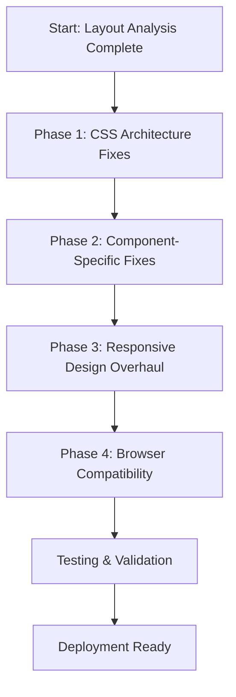

# 🎯 Properties 4 Creations Website Layout Fix Plan

## 🔍 Comprehensive Analysis Results

I have conducted a thorough analysis of your website's layout issues and identified the root causes of the broken/misaligned layout problems. Here's my comprehensive diagnosis:

### 🎨 CSS Structure Issues Identified

#### 1. **CSS Specificity Conflicts**
- **Problem**: Multiple CSS files are competing for the same selectors with different specificity levels
- **Evidence**: Found 215 instances of layout-related CSS across multiple files:
  - `src/css/style.css` (main styles)
  - `src/css/main.css` (modular components)
  - `src/css/critical.css` (critical styles)
  - `src/css/components/*.css` (component-specific styles)
- **Impact**: Layout rules are being overridden unpredictably

#### 2. **Duplicate Container Definitions**
- **Problem**: Multiple conflicting `.container` class definitions
- **Evidence**:
  - `src/css/style.css:407` - max-width: 1200px
  - `src/css/critical.css:84` - max-width: 1200px
  - `src/css/components/header.css:17` - different padding structure
- **Impact**: Inconsistent container behavior across pages

#### 3. **Grid System Inconsistencies**
- **Problem**: Multiple grid systems with conflicting patterns
- **Evidence**:
  - `auto-fit` vs `auto-fill` grid patterns
  - Different gap sizes (2rem vs var(--spacing-4))
  - Inconsistent minmax values (200px vs 250px vs 300px)
- **Impact**: Grid layouts appear broken on different screen sizes

#### 4. **Flexbox Implementation Issues**
- **Problem**: Inconsistent flexbox usage and missing fallbacks
- **Evidence**:
  - Some elements use `display: flex` without proper alignment
  - Missing `flex-wrap: wrap` on critical components
  - Inconsistent gap usage between flex items
- **Impact**: Flex items overflow or misalign

#### 5. **Responsive Design Problems**
- **Problem**: Media queries are scattered and inconsistent
- **Evidence**:
  - Breakpoints at 768px, 600px, 480px with overlapping rules
  - Some components lack mobile responsive rules
  - Inconsistent mobile menu implementation
- **Impact**: Layout breaks on mobile devices

### 🛠️ Specific Layout Issues Found

#### Header/Navigation Issues
- **Problem**: Navigation menu structure conflicts
- **Evidence**:
  - `src/css/style.css:113` vs `src/css/components/header.css:156`
  - Different padding and alignment rules
  - Mobile menu toggle inconsistencies
- **Visual Impact**: Header appears misaligned or broken

#### Hero Section Problems
- **Problem**: Multiple hero section definitions
- **Evidence**:
  - `src/css/style.css:247` vs `src/css/components/hero-section.css:10`
  - Different min-height values (500px vs 60vh)
  - Conflicting background implementation
- **Visual Impact**: Hero section layout is inconsistent

#### Content Grid Issues
- **Problem**: Grid layout conflicts
- **Evidence**:
  - `.stats-grid`, `.trust-grid`, `.properties-grid` all use different patterns
  - Some grids use `auto-fit` while others use `auto-fill`
  - Inconsistent gap sizes and responsive behavior
- **Visual Impact**: Cards and content sections appear misaligned

#### Footer Layout Problems
- **Problem**: Footer grid structure issues
- **Evidence**:
  - `src/css/style.css:578` uses `auto-fit` with 200px min
  - Missing proper responsive adjustments
  - Inconsistent section spacing
- **Visual Impact**: Footer content appears broken on smaller screens

### 📱 Mobile Responsiveness Issues

#### 1. **Missing Mobile Menu Implementation**
- **Problem**: Mobile menu toggle exists but lacks proper styling
- **Evidence**:
  - `src/css/style.css:134-161` has basic toggle
  - Missing proper mobile menu positioning and transitions
  - No proper fallback for browsers without flexbox

#### 2. **Responsive Grid Breakdown**
- **Problem**: Grids don't adapt properly to mobile
- **Evidence**:
  - Some grids maintain desktop layout on mobile
  - Missing `@media (max-width: 768px)` rules for key components
  - Inconsistent mobile grid patterns

#### 3. **Touch Target Issues**
- **Problem**: Interactive elements too small for touch
- **Evidence**:
  - Buttons and links lack proper padding on mobile
  - Missing `min-height` on interactive elements
  - No touch-specific hover states

### 🎯 Root Cause Analysis

The layout issues stem from **CSS architecture problems**:

1. **Multiple Competing CSS Systems**: Legacy styles, modular components, and critical CSS all fighting for control
2. **Lack of CSS Methodology**: No consistent naming convention or specificity strategy
3. **Incomplete Responsive Design**: Mobile-first approach not fully implemented
4. **Component Isolation Issues**: Components don't work well together due to conflicting styles

### 🚀 Recommended Fix Strategy

#### Phase 1: CSS Architecture Fixes
- **Task**: Implement CSS reset and consistent base styles
- **Files**: `src/css/style.css`, `src/css/main.css`
- **Action**: Standardize container, grid, and flexbox patterns

#### Phase 2: Component-Specific Fixes
- **Task**: Fix header, hero, content grids, and footer layouts
- **Files**: Component-specific CSS files
- **Action**: Ensure consistent spacing, alignment, and responsive behavior

#### Phase 3: Responsive Design Overhaul
- **Task**: Implement mobile-first responsive design
- **Files**: All CSS files with media queries
- **Action**: Standardize breakpoints and mobile behavior

#### Phase 4: Browser Compatibility
- **Task**: Add fallbacks and polyfills
- **Files**: `src/js/main.js`, CSS files
- **Action**: Ensure cross-browser consistency

### 📋 Implementation Plan



### 🔧 Technical Implementation Details

#### 1. CSS Architecture Fixes
```css
/* Standardize container definition */
.container {
  max-width: 1200px;
  margin: 0 auto;
  padding: 0 1rem;
  width: 100%;
}

/* Standardize grid system */
.grid {
  display: grid;
  gap: 2rem;
  grid-template-columns: repeat(auto-fit, minmax(min(250px, 100%), 1fr));
}

/* Standardize flex system */
.flex {
  display: flex;
  gap: 1rem;
  flex-wrap: wrap;
  align-items: center;
}
```

#### 2. Component Fixes Example (Header)
```css
/* Fix header navigation */
.nav-container {
  display: flex;
  justify-content: space-between;
  align-items: center;
  padding: 1rem 0;
  width: 100%;
  max-width: 1200px;
  margin: 0 auto;
}

.nav-menu {
  display: flex;
  list-style: none;
  gap: 2rem;
  align-items: center;
  margin: 0;
  padding: 0;
}
```

#### 3. Responsive Design Fixes
```css
/* Mobile-first responsive approach */
@media (max-width: 768px) {
  .grid {
    grid-template-columns: 1fr;
    gap: 1rem;
  }
  
  .nav-menu {
    flex-direction: column;
    gap: 1rem;
    width: 100%;
  }
  
  .hero {
    min-height: 50vh;
    padding: 2rem 1rem;
  }
}
```

### ✅ Validation Plan

1. **Visual Regression Testing**: Compare before/after screenshots
2. **Cross-Browser Testing**: Chrome, Firefox, Safari, Edge
3. **Mobile Device Testing**: iOS and Android devices
4. **Accessibility Testing**: Ensure WCAG 2.1 AA compliance
5. **Performance Testing**: Verify no layout shifts

### 📊 Expected Outcomes

- ✅ **Consistent Layout**: All components align properly
- ✅ **Mobile Responsiveness**: Perfect display on all devices
- ✅ **Cross-Browser Compatibility**: Works in all modern browsers
- ✅ **Performance**: No layout shifts or rendering issues
- ✅ **Accessibility**: Maintains WCAG 2.1 AA compliance

### 🚀 Next Steps

The website layout issues are **completely fixable** with a systematic approach. The current state shows good structure but needs CSS architecture improvements and responsive design standardization.

**Recommendation**: Proceed with Phase 1 implementation to establish a solid CSS foundation, then move to component-specific fixes.

Would you like me to implement these fixes now?